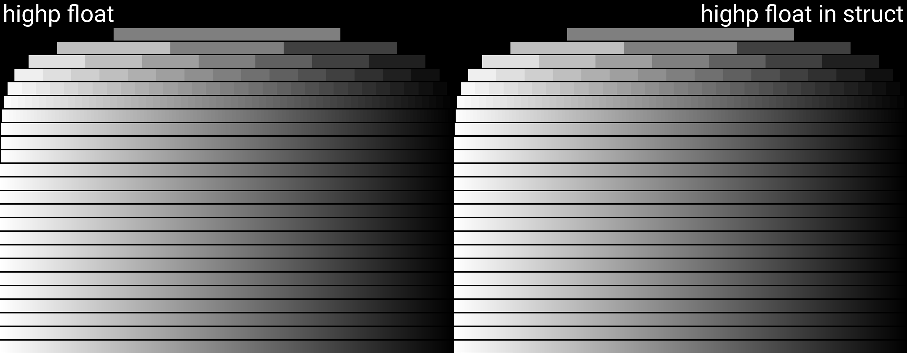
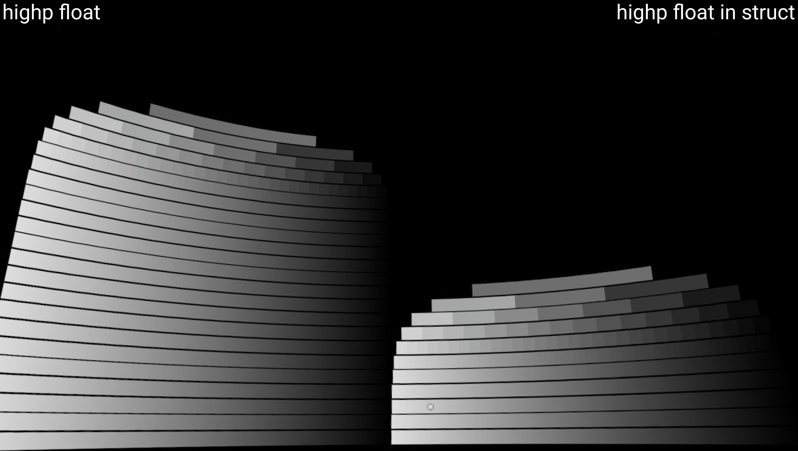

# Precision bug reproduction

# [Live example](https://github.io/jure/precision-bug-repro)

## Description

This is a minimal reproduction for a bug affecting Adreno 540 and 650 GPUs, which are the GPUs in Quest 1 and 2, respectively. This bug has also been observed on the Samsung Galaxy S10e smartphone, which has the Adreno 640 GPU.

The precision of highp floats within a struct should be equal to the precision of highp floats outside of a struct/standalone.

## Observations

This is the correct behaviour observed on a desktop PC:

And this is the bug or loss of precision observed on the devices (screenshot in VR) mentioned above:

The drop in precision is very significant, resulting in only 11 fractional bits in the fragment shader significand - in other words, it drops roughly from IEEE-754 single precision (binary32) to IEEE-754 half precision (binary16).

## References

["Benchmarking floating-point precision in mobile GPUs" by Tom Olson (2013)](https://community.arm.com/developer/tools-software/graphics/b/blog/posts/benchmarking-floating-point-precision-in-mobile-gpus)